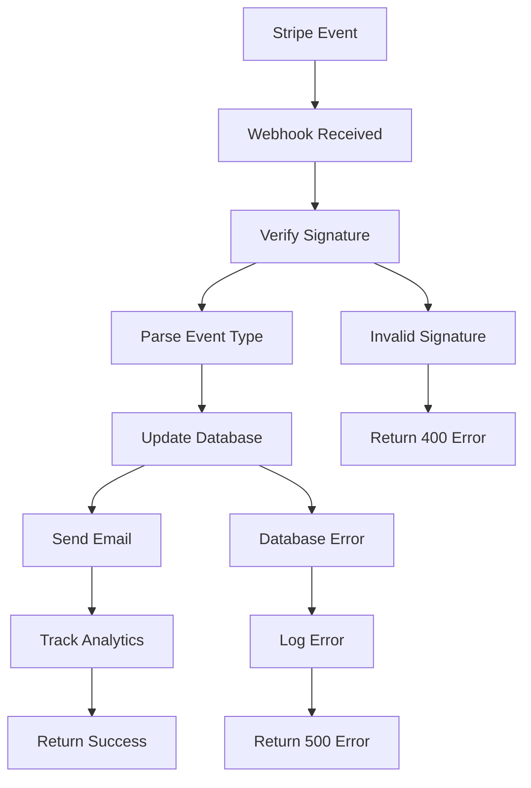

# Stripe Webhooks Integration

Complete guide for setting up and managing Stripe webhooks in the Zenith platform.

## 🎯 Overview

Stripe webhooks allow real-time synchronization between Stripe events and your application. This ensures that subscription changes, payments, and customer updates are immediately reflected in your database and trigger appropriate user notifications.

## 📋 Supported Events

The Zenith platform handles the following Stripe webhook events:

### Customer Events
- **`customer.created`** - Links new Stripe customers to user accounts
- **`customer.updated`** - Syncs customer information changes

### Subscription Events
- **`customer.subscription.created`** - Activates new subscriptions, sends welcome emails
- **`customer.subscription.updated`** - Updates subscription plans, sends change notifications
- **`customer.subscription.deleted`** - Handles subscription cancellations

### Payment Events
- **`invoice.payment_succeeded`** - Confirms successful payments, sends receipts
- **`invoice.payment_failed`** - Handles payment failures, triggers retry flows

### Checkout Events
- **`checkout.session.completed`** - Tracks successful checkout completions

## 🚀 Quick Setup

### Development Setup

1. **Install Stripe CLI**
   ```bash
   # macOS
   brew install stripe/stripe-cli/stripe
   
   # Linux/Windows
   # Download from: https://github.com/stripe/stripe-cli/releases
   ```

2. **Login to Stripe**
   ```bash
   stripe login
   ```

3. **Forward webhooks to local development**
   ```bash
   stripe listen --forward-to localhost:3000/api/stripe/webhooks
   ```

4. **Copy the webhook signing secret and add to `.env.local`**
   ```bash
   STRIPE_WEBHOOK_SECRET=whsec_...
   ```

5. **Test webhook delivery**
   ```bash
   stripe trigger customer.subscription.created
   ```

### Production Setup

1. **Go to Stripe Dashboard**: https://dashboard.stripe.com/webhooks

2. **Add endpoint**: `https://yourdomain.com/api/stripe/webhooks`

3. **Select events** (copy the exact event names):
   ```
   customer.created
   customer.updated
   customer.subscription.created
   customer.subscription.updated
   customer.subscription.deleted
   invoice.payment_succeeded
   invoice.payment_failed
   checkout.session.completed
   ```

4. **Add environment variables**:
   ```bash
   STRIPE_SECRET_KEY=sk_live_...
   STRIPE_PUBLISHABLE_KEY=pk_live_...
   STRIPE_WEBHOOK_SECRET=whsec_...
   ```

## 🛠️ Using the Setup Script

Run the interactive setup script:

```bash
node scripts/setup-stripe-webhooks.js
```

Or use specific commands:

```bash
# Show webhook events reference
node scripts/setup-stripe-webhooks.js --events

# Show environment variables template
node scripts/setup-stripe-webhooks.js --env

# Show monitoring tips
node scripts/setup-stripe-webhooks.js --monitoring
```

## 📊 Webhook Monitoring

### Admin Dashboard

Access the webhook monitor at `/admin/webhooks` to:
- View all webhook events and their status
- Retry failed webhook processing
- Monitor webhook delivery success rates
- Debug webhook payloads and errors

### Key Metrics

The webhook monitor displays:
- **Total Events**: All received webhook events
- **Processed**: Successfully handled events
- **Failed**: Events that encountered errors
- **Pending**: Events waiting to be processed
- **Success Rate**: Percentage of successful deliveries

### Troubleshooting Failed Webhooks

1. **Check the error message** in the webhook monitor
2. **Verify webhook signature** - ensure `STRIPE_WEBHOOK_SECRET` is correct
3. **Check database connectivity** - ensure Prisma can connect
4. **Verify user exists** - webhook handlers require valid user records
5. **Retry processing** using the admin interface

## 🔧 Implementation Details

### Webhook Handler Structure

```typescript
// /app/api/stripe/webhooks/route.ts
export async function POST(request: NextRequest) {
  // 1. Verify webhook signature
  // 2. Parse Stripe event
  // 3. Route to appropriate handler
  // 4. Update database
  // 5. Send notifications
  // 6. Return success response
}
```

### Event Processing Flow



### Database Schema Requirements

To fully support webhook functionality, add these fields to your `User` model:

```prisma
model User {
  // ... existing fields
  
  // Stripe Integration
  stripeCustomerId     String?   @unique
  stripeSubscriptionId String?   @unique
  subscriptionStatus   String?   // active, canceled, past_due, etc.
  subscriptionPlan     String?   // free, pro, enterprise
  currentPeriodStart   DateTime?
  currentPeriodEnd     DateTime?
  cancelAtPeriodEnd    Boolean   @default(false)
  
  // Analytics
  subscriptionEvents   SubscriptionEvent[]
  
  @@index([stripeCustomerId])
  @@index([stripeSubscriptionId])
}

model SubscriptionEvent {
  id          String   @id @default(cuid())
  userId      String
  user        User     @relation(fields: [userId], references: [id])
  eventType   String   // subscription_created, plan_changed, etc.
  oldValue    String?
  newValue    String?
  metadata    Json?
  timestamp   DateTime @default(now())
  
  @@index([userId])
  @@index([eventType])
  @@index([timestamp])
}
```

## 📧 Email Integration

Webhooks automatically trigger email notifications:

### Welcome Emails
- Sent when `customer.subscription.created` is received
- Uses the user's name from Stripe customer data
- Includes login link and getting started information

### Payment Confirmations
- Sent when `invoice.payment_succeeded` is received
- Includes invoice amount, plan details, and download link
- Provides next billing date information

### Subscription Updates
- Sent when `customer.subscription.updated` is received with plan changes
- Shows old vs new plan comparison
- Includes effective date and pricing information

## 🔒 Security Best Practices

### Webhook Signature Verification

All webhooks are verified using Stripe's signature verification:

```typescript
const signature = headers().get('stripe-signature')
const event = stripe.webhooks.constructEvent(body, signature, webhookSecret)
```

### Idempotency

Handle duplicate webhook deliveries by:
1. Storing processed event IDs
2. Checking for existing records before creating
3. Using database transactions for atomic updates

### Error Handling

```typescript
try {
  await handleWebhookEvent(event)
  return NextResponse.json({ received: true })
} catch (error) {
  console.error('Webhook error:', error)
  // Log error for monitoring
  // Don't expose internal details
  return NextResponse.json({ error: 'Processing failed' }, { status: 500 })
}
```

## 📈 Monitoring and Analytics

### Event Tracking

Track webhook events for business analytics:

```typescript
await trackEvent('subscription_created', {
  userId: user.id,
  subscriptionId: subscription.id,
  plan: planName,
  amount: amount / 100
})
```

### Health Monitoring

Monitor webhook health with:
- Success/failure rates
- Processing latency
- Error frequency
- Event volume trends

### Alerting

Set up alerts for:
- High failure rates (>5%)
- Processing delays (>30 seconds)
- Unexpected event volumes
- Critical event failures (payment processing)

## 🧪 Testing

### Development Testing

```bash
# Test subscription creation
stripe trigger customer.subscription.created

# Test payment success
stripe trigger invoice.payment_succeeded

# Test payment failure
stripe trigger invoice.payment_failed

# Custom event with specific data
stripe events resend evt_... # Use real event ID
```

### Production Testing

1. Create a test customer in Stripe Dashboard
2. Create a test subscription
3. Process a test payment
4. Verify events appear in webhook monitor
5. Check that emails are sent correctly

### Load Testing

Test webhook endpoint under load:

```bash
# Using Apache Bench
ab -n 1000 -c 10 -H "Content-Type: application/json" \
   -p webhook-payload.json \
   https://yourdomain.com/api/stripe/webhooks
```

## 🐛 Common Issues

### 1. Webhook Signature Verification Failed

**Cause**: Incorrect webhook secret or payload modification

**Solution**:
- Verify `STRIPE_WEBHOOK_SECRET` is correct
- Ensure raw request body is used for verification
- Check for middleware that might modify the request

### 2. User Not Found for Customer

**Cause**: Stripe customer email doesn't match any user in database

**Solution**:
- Ensure user registration creates matching email
- Handle missing users gracefully
- Consider creating users from webhook data

### 3. Database Connection Errors

**Cause**: Database unavailable during webhook processing

**Solution**:
- Implement connection retry logic
- Use connection pooling
- Monitor database health

### 4. Email Delivery Failures

**Cause**: Email service not configured or user preferences

**Solution**:
- Check email service configuration
- Implement graceful email failure handling
- Respect user notification preferences

## 📚 Additional Resources

- [Stripe Webhooks Documentation](https://stripe.com/docs/webhooks)
- [Stripe CLI Documentation](https://stripe.com/docs/stripe-cli)
- [Webhook Security Guide](https://stripe.com/docs/webhooks/signatures)
- [Testing Webhooks](https://stripe.com/docs/webhooks/test)

## 🔄 Maintenance

### Regular Tasks

1. **Monitor webhook delivery rates** (weekly)
2. **Review failed webhook events** (daily)
3. **Update webhook event handling** (as needed)
4. **Test webhook delivery** (monthly)
5. **Review webhook security** (quarterly)

### Upgrades

When upgrading Stripe API versions:
1. Test webhook compatibility
2. Update event handling if needed
3. Deploy with feature flags
4. Monitor for issues
5. Rollback if problems occur

---

**🎯 This webhook integration ensures real-time synchronization between Stripe and your application, providing users with immediate updates and maintaining data consistency across all systems.**